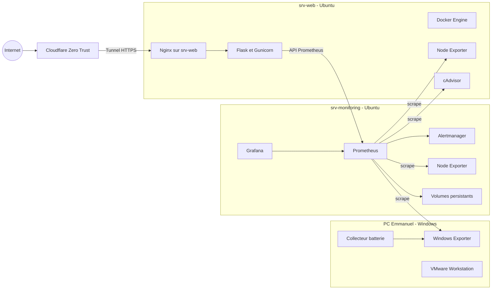
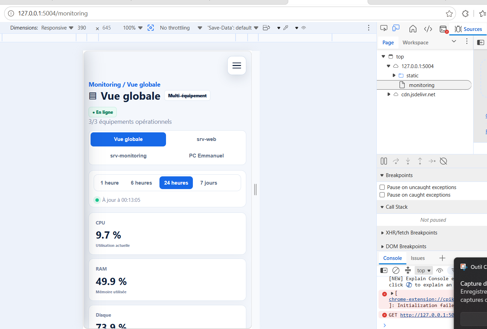

# Secure Local Cloud Infrastructure v2

Portail local de supervision et d'administration d'une infrastructure auto-hebergee. Le projet regroupe une application Flask, un proxy HTTPS Nginx et une pile de metriques Prometheus, Alertmanager, Grafana, Node Exporter et cAdvisor.

> Ce depot fournit une base de deploiement. Les adresses IP, noms d'hote, chemins de volumes et certificats doivent etre adaptes a votre environnement. Aucun secret reel ne doit etre versionne.

## Fonctionnalites

- tableau de bord web et vues de supervision ;
- etat des conteneurs Docker et metriques systeme ;
- integration Prometheus, Grafana et Alertmanager ;
- audit, consultation de journaux et export de rapports PDF ;
- authentification administrateur configuree par variables d'environnement ;
- terminaison TLS et reverse proxy avec Nginx.

## Architecture



L'installation réelle comprend trois équipements : le PC Windows d'administration, `srv-web` pour le portail et la collecte locale, et `srv-monitoring` pour la centralisation, l'historique, la visualisation et les alertes.

L'[architecture technique détaillée](docs/ARCHITECTURE.md) documente les équipements, les réseaux, les flux HTTPS, les collecteurs, les volumes et les limites de sécurité.

## Arborescence utile

```text
application/          Application Flask et conteneur web
monitoring/           Prometheus, Alertmanager et Grafana
nginx/                Exemples de configuration du reverse proxy
services/             Unite systemd Node Exporter
systemd/              Services et timers d'export des journaux
scripts/              Scripts d'exploitation
docs/                 Installation, architecture et securite
docs/screenshots/     Captures d'ecran publiques
```

## Prerequis

- Linux avec Docker Engine et Docker Compose v2 ;
- Nginx si le reverse proxy est installe sur l'hote ;
- un certificat et une cle TLS ;
- connectivite entre les machines et ports strictement filtres par pare-feu.

## Demarrage rapide

1. Clonez le depot et placez-vous dans `application/`.
2. Copiez `.env.example` vers `.env`.
3. Generez une cle secrete et un mot de passe robuste.
4. Adaptez les URL, adresses IP et volumes dans les fichiers Compose.
5. Lancez les services.

```bash
git clone https://github.com/VOTRE_COMPTE/secure-local-cloud-infrastructure-v2.git
cd secure-local-cloud-infrastructure-v2/application
cp .env.example .env
python3 -c "import secrets; print(secrets.token_urlsafe(48))"
docker compose config
docker compose up -d --build
```

Renseignez la valeur generee dans `SECRET_KEY` avant le lancement. Consultez [le guide d'installation](docs/INSTALLATION.md) pour le deploiement complet.

## Configuration

Les secrets sont lus depuis `application/.env`, fichier ignore par Git. Le modele `application/.env.example` ne contient aucune valeur confidentielle.

| Variable | Role |
|---|---|
| `SECRET_KEY` | Signature des sessions Flask, valeur longue et aleatoire |
| `ADMIN_USERNAME` | Identifiant administrateur |
| `ADMIN_PASSWORD` | Mot de passe initial ; preferer un secret injecte au deploiement |
| `ADMIN_PASSWORD_HASH` | Empreinte du mot de passe si cette option est utilisee |
| `PROMETHEUS_URL` | URL interne de Prometheus |
| `GRAFANA_URL` | URL interne de Grafana |
| `ALERTMANAGER_URL` | URL interne d'Alertmanager |

## Captures d'ecran

### Vue d'ensemble


### Supervision des ressources

La vue de monitoring présente les mesures en temps réel et leur historique : CPU, mémoire vive, espace disque, seuils surveillés et export PDF.


### Version mobile

La navigation responsive masque la barre latérale derrière un bouton de menu et empile les indicateurs pour conserver une lecture claire sur téléphone.



### Conteneurs Docker

Cette vue centralise l'état, la consommation et les actions d'exploitation des conteneurs exécutés sur `srv-web`.


### Architecture de l'infrastructure

La cartographie visualise le chemin d'accès externe, les réseaux privés, les deux serveurs et les principaux services de la plateforme.


## Securite

Ce projet monte le socket Docker dans le conteneur web et cAdvisor utilise des acces privilegies. Ces droits sont tres puissants : ne rendez jamais ces services directement accessibles depuis Internet. Placez-les sur un reseau d'administration, limitez les ports avec un pare-feu et protegez le portail par TLS et authentification forte.

Avant chaque publication, consultez [SECURITY.md](SECURITY.md), verifiez l'historique Git et effectuez une recherche de secrets.

## Documentation

- [Installation](docs/INSTALLATION.md)
- [Architecture physique, réseau et applicative](docs/ARCHITECTURE.md)
- [Guide du code et des fichiers](docs/GUIDE-DU-CODE.md)
- [Alertes Prometheus, Alertmanager et Telegram](docs/ALERTES-TELEGRAM.md)
- [Sauvegardes, réplication et restauration](docs/SAUVEGARDES-RESTAURATION.md)
- [Sécurité et secrets](SECURITY.md)

### Dossiers PDF

- [Audit avant/après corrections](output/pdf/audit-avant-apres-secure-local-cloud.pdf)
- [Guide utilisateur](output/pdf/guide-utilisateur-secure-local-cloud.pdf)
- [Manuel administrateur et dossier technique](output/pdf/manuel-administrateur-secure-local-cloud.pdf)

## Etat du projet

Projet personnel d'infrastructure locale, a adapter et auditer avant tout usage en production.

Le depot public ne contient ni sauvegarde de production, ni base de donnees, ni fichier `.env`, ni jeton Telegram, ni cle Cloudflare, ni cle SSH. Les valeurs sensibles sont injectees uniquement sur les serveurs.
