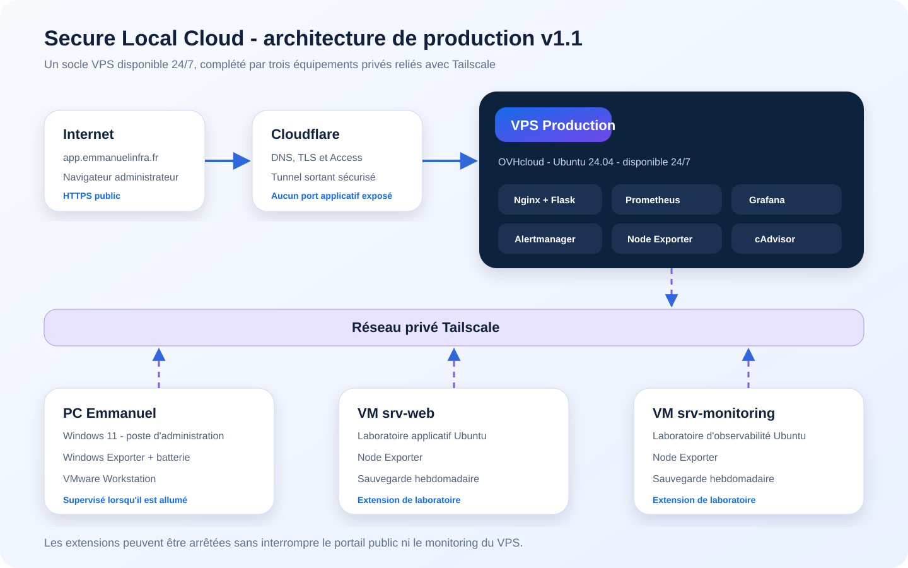
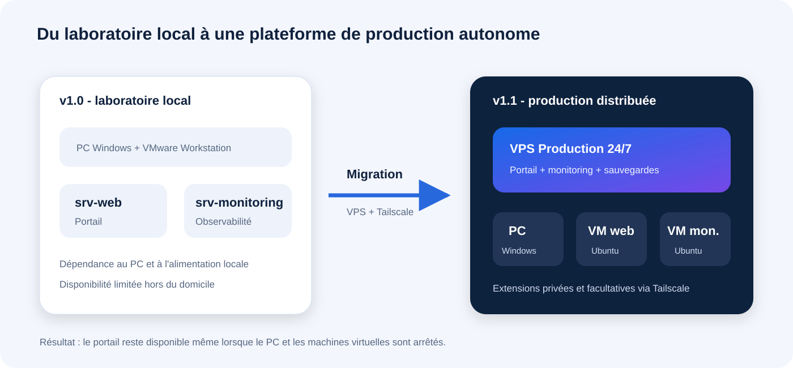
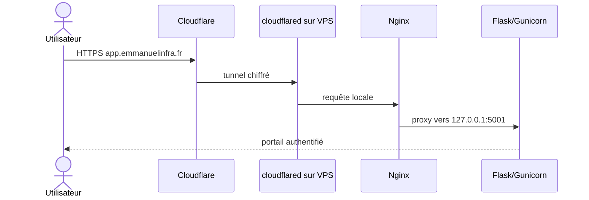
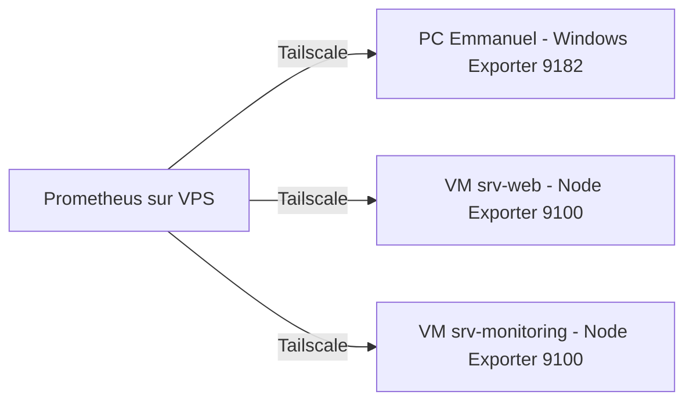

# Architecture technique réelle

Ce document décrit l'architecture de production introduite avec la version `v1.1.0`. Elle prolonge le laboratoire VMware de la version `v1.0.0` sans le supprimer : le laboratoire devient une extension facultative d'un socle VPS autonome.

## État validé au 17 août 2026

| Équipement | Fonction | Disponibilité attendue |
|---|---|---|
| VPS Production | Portail, collecte, historique, visualisation, alertes et sauvegarde | 24 h/24 |
| PC Emmanuel | Poste d'administration, Windows Exporter, batterie et hôte VMware | Lorsque le PC est allumé |
| VM `srv-web` | Laboratoire applicatif et Node Exporter | À la demande |
| VM `srv-monitoring` | Laboratoire d'observabilité et Node Exporter | À la demande |

Le portail public ne dépend plus du PC ni des VM. Lorsqu'une extension est arrêtée, seules ses propres métriques deviennent indisponibles.

## Évolution depuis la version 1.0

La première version séparait le portail et la supervision dans deux VM VMware. Cette organisation reste utile pour les exercices, mais elle dépendait du PC physique et du réseau domestique. La version 1.1 place les services permanents sur OVHcloud et relie les équipements privés avec Tailscale.

## Composition du VPS Production

| Composant | Fonction | Exposition |
|---|---|---|
| Nginx | Reverse proxy local | Ports publics 80/443 selon la configuration |
| Flask et Gunicorn | Portail, authentification, API et vues | `127.0.0.1:5001` |
| Prometheus | Collecte et stockage temporel | `127.0.0.1:9090`, protégé par Cloudflare Access |
| Grafana | Visualisation avancée | `127.0.0.1:3000`, protégé par Cloudflare Access |
| Alertmanager | Routage des alertes | `127.0.0.1:9093` |
| Node Exporter | Métriques du VPS | Réseau Docker privé |
| cAdvisor | Métriques des conteneurs | Réseau Docker privé |
| cloudflared | Tunnel sortant vers Cloudflare | Aucun port entrant requis pour le tunnel |
| Tailscale | Réseau privé entre les équipements | Interface privée `tailscale0` |

## Flux public

Grafana et Prometheus utilisent le même tunnel mais sont précédés par Cloudflare Access. Ils ne doivent pas être exposés directement sur Internet.

## Flux de supervision privé

Les pare-feu des équipements autorisent les ports des exporters uniquement depuis l'adresse Tailscale du VPS. Les adresses Tailscale réelles et les secrets restent hors du dépôt public ; les exemples utilisent des valeurs à remplacer.

## Cibles Prometheus

| Job | Équipement | Rôle | Alerte d'indisponibilité |
|---|---|---|---|
| `vps-production` | VPS Production | Production | Oui |
| `cadvisor` | VPS Production | Conteneurs | Oui |
| `pc-windows` | PC Emmanuel | Administration | Non, extension facultative |
| `lab-srv-web` | VM `srv-web` | Laboratoire applicatif | Non |
| `lab-srv-monitoring` | VM `srv-monitoring` | Laboratoire d'observabilité | Non |

Une cible absente ne doit jamais être représentée par une mesure égale à zéro. L'interface distingue les états `UP`, `DOWN`, non connecté et en attente d'historique.

## Persistance et sauvegardes

Les volumes Docker de Prometheus, Grafana et Alertmanager conservent les données lors de la recréation des conteneurs. Ils sont inclus dans la sauvegarde du VPS, mais un volume n'est pas à lui seul une sauvegarde.

| Machine | Fréquence | Rétention |
|---|---|---|
| VPS Production | Quotidienne | 3 générations |
| VM `srv-web` | Hebdomadaire | 2 générations |
| VM `srv-monitoring` | Hebdomadaire | 2 générations |

Toutes les archives sont contrôlées avec SHA-256. Les sauvegardes de production restent privées et ne sont jamais publiées dans Git.

## Frontières de sécurité

- les secrets sont injectés par des fichiers exclus de Git ;
- le socket Docker et les interfaces internes ne sont jamais publiés directement ;
- SSH utilise une clé et l'authentification par mot de passe est désactivée sur le VPS ;
- UFW limite les ports entrants ;
- Cloudflare Access protège les consoles sensibles ;
- Tailscale transporte les flux de collecte privés ;
- les équipements de laboratoire peuvent être arrêtés sans fausse alerte critique.

## Ajouter un équipement

1. Installer l'exporter adapté à l'équipement.
2. Relier l'équipement au même réseau Tailscale.
3. Limiter le pare-feu à l'adresse Tailscale du VPS.
4. Ajouter une cible et des labels explicites dans Prometheus.
5. Valider la configuration avec `promtool`.
6. Ajouter l'équipement au modèle de configuration Flask et aux tests.
7. Vérifier les KPI, les courbes, l'état hors ligne et l'absence de fausse alerte.

Pour le détail des changements publiés, consulter les [notes de version 1.1.0](RELEASE-v1.1.0.md).
