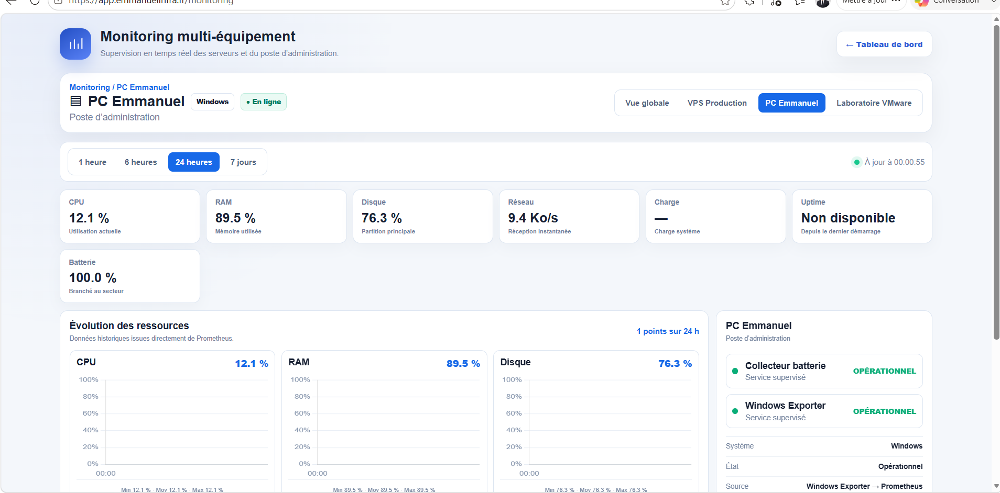
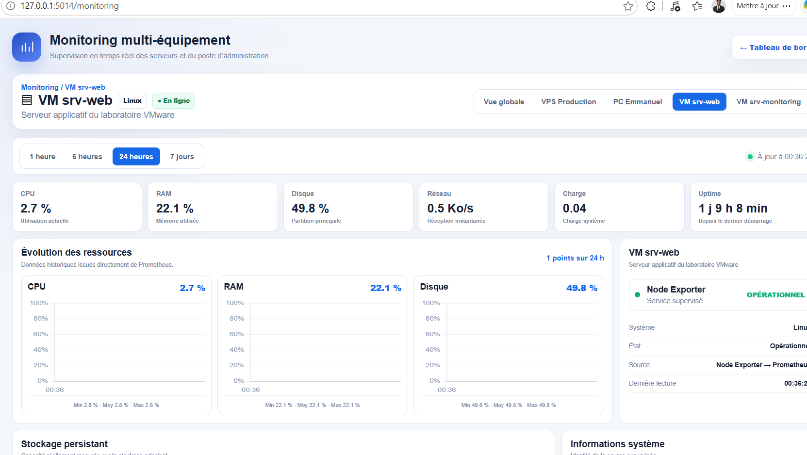
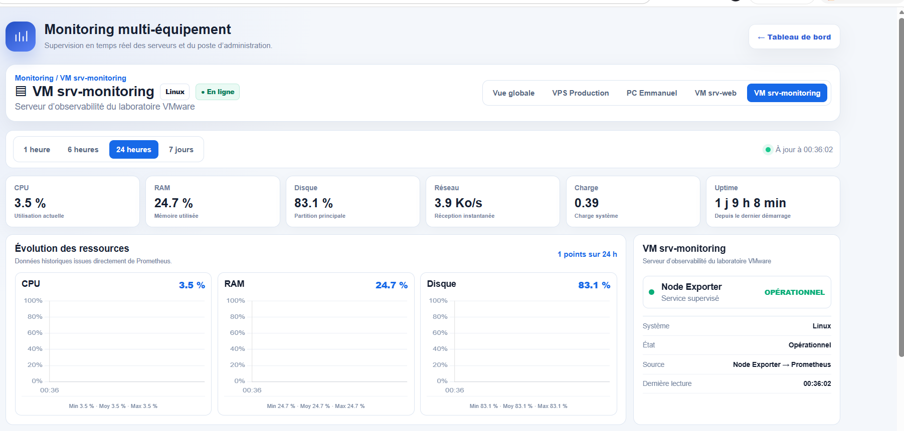

# Secure Local Cloud Infrastructure v1.1.0

La version `v1.1.0` poursuit directement le travail publié en `v1.0.0`. Le projet quitte son architecture uniquement locale pour devenir une plateforme de production hébergée sur un VPS OVHcloud, disponible indépendamment du PC d'administration.

## Ce qui change

- le VPS Production devient le socle permanent du portail et de l'observabilité ;
- Nginx, Flask/Gunicorn, Prometheus, Grafana, Alertmanager, Node Exporter et cAdvisor fonctionnent sur le VPS ;
- Cloudflare Tunnel publie le portail sans exposition directe du port Flask ;
- Cloudflare Access protège Grafana et Prometheus ;
- Tailscale relie le VPS au PC Emmanuel et aux deux VM VMware ;
- Prometheus collecte désormais les métriques réelles des quatre équipements ;
- les équipements arrêtés sont présentés comme hors ligne, sans valeur artificiellement forcée à zéro ;
- les sauvegardes sont automatisées, vérifiées par SHA-256 et soumises à une rétention contrôlée ;
- les fichiers de déploiement VPS sont fournis sous forme de modèles sans secrets.

## Architecture v1.1

Le VPS reste opérationnel 24 heures sur 24. Le PC Windows et les VM servent d'extensions privées : leur arrêt ne coupe ni le portail public, ni Grafana, ni Prometheus, ni les métriques du VPS.

| Équipement | Rôle | Collecte |
|---|---|---|
| VPS Production | Hébergement, portail, observabilité et alertes | Node Exporter et cAdvisor |
| PC Emmanuel | Administration Windows et hôte VMware | Windows Exporter et collecteur batterie |
| VM `srv-web` | Laboratoire applicatif | Node Exporter |
| VM `srv-monitoring` | Laboratoire d'observabilité | Node Exporter |

## Captures de la supervision réelle

### PC Emmanuel

### VM srv-web

### VM srv-monitoring

## Sauvegardes

Les trois environnements disposent de leurs propres sauvegardes :

- VPS Production : sauvegarde quotidienne avec trois générations conservées ;
- VM `srv-web` : sauvegarde hebdomadaire avec deux générations conservées ;
- VM `srv-monitoring` : sauvegarde hebdomadaire avec deux générations conservées.

Chaque archive est accompagnée d'une empreinte SHA-256. Les sauvegardes privées, bases, secrets, jetons et clés ne sont jamais inclus dans le dépôt GitHub.

## Déploiement

Les modèles destinés au VPS se trouvent dans `deployment/` :

- `docker-compose.yml` décrit la pile de production ;
- `config/` contient les modèles Prometheus et Alertmanager ;
- `secrets/*.example` documente les variables sans publier leur valeur ;
- `nginx/secure-local-cloud-vps.conf` fournit le reverse proxy ;
- `systemd/` et `scripts/` fournissent la sauvegarde planifiée.

Consultez également [l'architecture détaillée](ARCHITECTURE.md), [le guide d'installation](INSTALLATION.md) et [le guide de sauvegarde et restauration](SAUVEGARDES-RESTAURATION.md).

## Validation

- les quatre cibles Prometheus ont été observées en état `UP` ;
- le portail public a répondu en HTTP 200 via Cloudflare ;
- Grafana et Prometheus ont redirigé vers Cloudflare Access ;
- la santé globale de l'application a été validée après stabilisation ;
- les archives de sauvegarde ont passé le contrôle SHA-256 ;
- les configurations Prometheus et les règles d'alerte ont été validées avec `promtool`.

## Finalisation du 19 août 2026

- liaison Tailscale validée entre le VPS, le PC et les deux VM ;
- remontée réelle des métriques Windows et Linux ;
- Telegram validé de bout en bout ;
- distinction entre alertes critiques de production et avertissements conditionnels du laboratoire ;
- récupération automatique du réseau VMware au démarrage de Windows ;
- documentation consolidée dans un dossier unique avec PDF et présentation.
