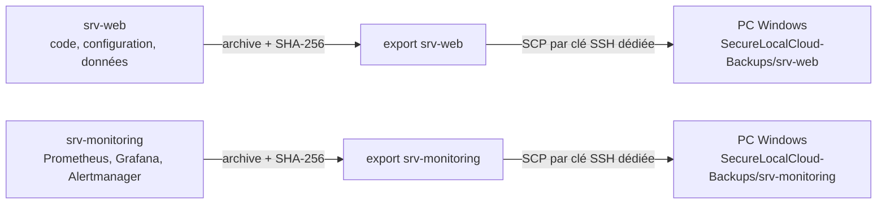

# Sauvegardes, réplication et restauration

## Différence entre persistance, sauvegarde et réplication

- un **volume persistant** survit au remplacement d’un conteneur ;
- une **sauvegarde** est une archive indépendante créée sur le serveur ;
- la **réplication** copie et vérifie cette archive sur le PC Windows.



## Emplacements

| Élément | Emplacement |
|---|---|
| Export `srv-web` | `/home/emmanuel/backup-export/srv-web/` |
| Export `srv-monitoring` | `/home/emmanuel/backup-export/srv-monitoring/` |
| Copies PC `srv-web` | `C:\Users\Emman\SecureLocalCloud-Backups\srv-web\` |
| Copies PC `srv-monitoring` | `C:\Users\Emman\SecureLocalCloud-Backups\srv-monitoring\` |
| Journal de réplication | `C:\Users\Emman\SecureLocalCloud-Backups\logs\replication.log` |
| Script de réplication | `C:\Users\Emman\SecureLocalCloud-Backups\sync-secure-cloud-backups.ps1` |

Les archives `.tar.gz` sont accompagnées d’une empreinte `.sha256`. La tâche Windows `Secure Local Cloud - Replication` lance automatiquement la copie et la vérification.

## Ce que permettent les archives

- restaurer le code et les configurations après une erreur ;
- reconstruire les conteneurs ;
- récupérer l’historique Prometheus et les tableaux Grafana ;
- conserver l’état d’Alertmanager ;
- migrer vers de nouvelles machines ;
- tester une restauration sans toucher à la production.

## Contrôles réguliers

Sur Linux :

```bash
systemctl list-timers --all | grep backup
sha256sum -c ./*.tar.gz.sha256
```

Sur Windows PowerShell :

```powershell
Get-ScheduledTaskInfo -TaskName "Secure Local Cloud - Replication"
Get-Content "$env:USERPROFILE\SecureLocalCloud-Backups\logs\replication.log" -Tail 30
Get-ChildItem "$env:USERPROFILE\SecureLocalCloud-Backups" -Recurse -File
```

## Restauration sûre

1. Ne jamais restaurer directement sur la production comme premier essai.
2. Copier l’archive choisie sur une machine de test.
3. Vérifier son empreinte SHA-256.
4. Extraire dans un dossier vide.
5. contrôler les fichiers, permissions et variables d’environnement.
6. Recréer les volumes et conteneurs sur la machine de test.
7. Tester l’authentification, les métriques, les alertes et les rapports.
8. Planifier ensuite la restauration de production avec un retour arrière.

Une sauvegarde n’est considérée fiable qu’après un test de restauration réussi.

## État vérifié au 19 août 2026

Les minuteries systemd sont actives. Les archives conservées ont été contrôlées avec SHA-256. La rétention est limitée afin de protéger l’espace disque : trois générations sur le VPS et deux sur chaque VM. Une restauration complète reste à tester périodiquement.
