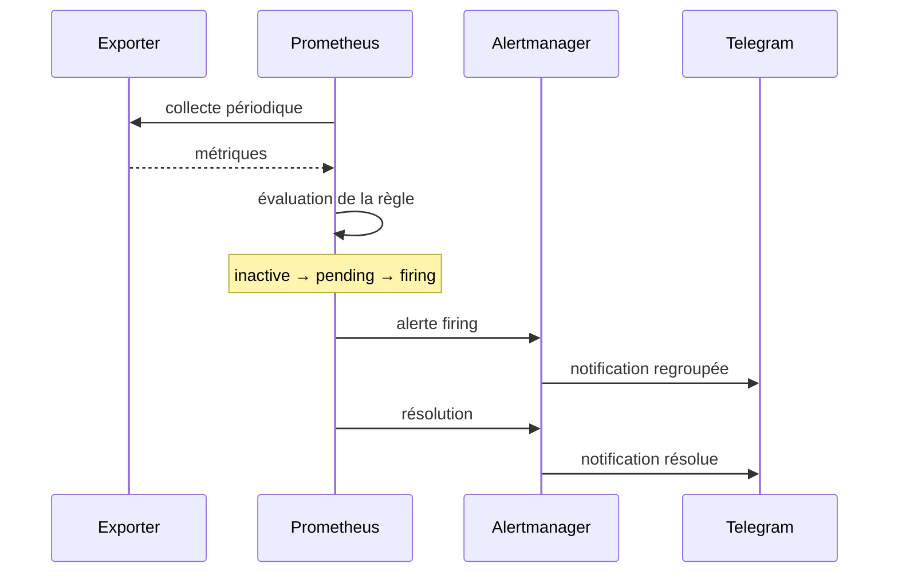

# Alertes Prometheus, Alertmanager et Telegram

## Fonctionnement



- `inactive` : la condition n’est pas remplie ;
- `pending` : le seuil est dépassé, mais la durée de confirmation n’est pas terminée ;
- `firing` : le dépassement est confirmé et transmis à Alertmanager ;
- `resolved` : la valeur est revenue à la normale.

La durée `for` évite les notifications provoquées par un pic de quelques secondes.

## Couverture actuelle

| Famille | Équipements | Contrôle |
|---|---|---|
| Disponibilité | services Linux, cAdvisor | cible Prometheus indisponible |
| CPU | deux serveurs et PC | charge durablement élevée |
| RAM | deux serveurs et PC | pression mémoire ; critique sur le PC au-delà de 90 % |
| Disque | deux serveurs et disque `C:` | avertissement puis niveau critique |
| Application | `srv-web` | disparition du conteneur Flask |
| Batterie | PC Emmanuel | batterie faible, critique ou collecteur figé |
| Sauvegarde | `srv-web` | échec, ancienneté ou métrique absente |

Le PC porte le label `alert_on_down=false`. Son extinction ou sa veille normale ne déclenche donc pas `TargetDown`. Lorsque Windows Exporter est joignable, les règles CPU, RAM, disque et batterie restent actives.

## Contenu d’une notification

Chaque message indique : nom de l’alerte, équipement, instance, rôle, sévérité, résumé, valeur ou détail. `send_resolved: true` provoque un second message lorsque l’incident disparaît.

## Fichiers et commandes de contrôle

- règles : `monitoring/alerts.yml` ;
- routage Telegram : `monitoring/alertmanager.yml` ;
- cibles : `monitoring/prometheus.yml`.

```bash
docker compose exec -T prometheus promtool check rules /etc/prometheus/alerts.yml
docker compose exec -T alertmanager amtool check-config /etc/alertmanager/alertmanager.yml
curl -fsS http://127.0.0.1:9090/api/v1/alerts | python3 -m json.tool
curl -fsS http://127.0.0.1:9093/api/v2/alerts | python3 -m json.tool
```

Ne jamais publier `bot_token` ou `chat_id`. Le dépôt public doit uniquement documenter leur injection sécurisée.
