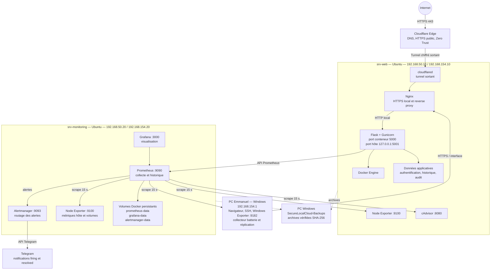
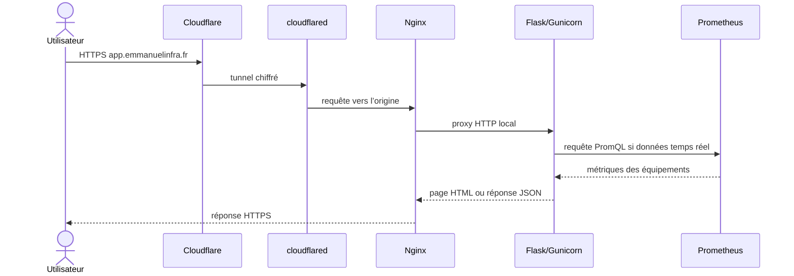
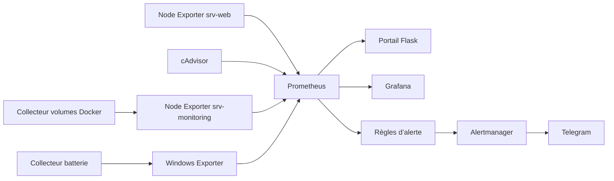

# Architecture technique réelle

Ce document décrit l’installation multi-équipement actuellement exploitée. Les adresses sont celles du laboratoire ; elles doivent être adaptées lors d’une migration.

## État validé au 10 août 2026

| Équipement | Fonction | Composants réellement présents |
|---|---|---|
| PC Emmanuel | Administration, hébergement VMware et supervision Windows | Windows 11, VMware Workstation, Windows Exporter, collecteur batterie, SSH et réplication des sauvegardes |
| `srv-web` | Serveur applicatif et collecte locale | Cloudflare Tunnel, Nginx, Flask/Gunicorn, Docker Engine, Node Exporter et cAdvisor |
| `srv-monitoring` | Collecte, stockage, visualisation et alertes | Prometheus, Grafana, Alertmanager, Node Exporter, Docker Engine et volumes persistants |

Les vues publiques `/monitoring` et `/infrastructure` utilisent cette topologie. Les mesures affichées proviennent de Prometheus et les états absents ne sont pas remplacés artificiellement par zéro.

## Vue physique et réseau

## Rôle de chaque zone

| Zone | Rôle | Éléments importants |
|---|---|---|
| Accès public | Publier sans port entrant sur la box | Cloudflare DNS, HTTPS et Tunnel |
| `srv-web` | Servir la plateforme | Nginx, Flask, Gunicorn, Docker, cAdvisor, Node Exporter |
| `srv-monitoring` | Observer et alerter | Prometheus, Grafana, Alertmanager, Node Exporter |
| PC Emmanuel | Administrer et être supervisé | navigateur, SSH, Windows Exporter, batterie, réplication |
| Telegram | Prévenir l’administrateur | alertes critiques, avertissements et résolutions |

## Chemin d’une requête utilisateur

Le certificat public est géré côté Cloudflare. Nginx protège et distribue le trafic sur `srv-web`. Gunicorn exécute l’application Flask ; il ne doit pas être exposé directement à Internet.

## Chaîne de supervision

Prometheus interroge périodiquement les exporters. Une valeur absente reste inconnue : elle ne doit jamais être transformée artificiellement en zéro. Le portail interroge Prometheus pour afficher les valeurs actuelles et les historiques.

## Données persistantes

| Donnée | Emplacement logique | Emplacement sur l’hôte |
|---|---|---|
| Séries Prometheus | `prometheus-data` | `/var/lib/docker/volumes/monitoring_prometheus-data/_data` |
| Tableaux Grafana | `grafana-data` | `/var/lib/docker/volumes/monitoring_grafana-data/_data` |
| État Alertmanager | `alertmanager-data` | `/var/lib/docker/volumes/monitoring_alertmanager-data/_data` |
| Données Flask | `application/data/` | volume ou dossier de `srv-web` |
| Configuration sensible | `application/.env` | uniquement sur `srv-web`, permission `600` |

Un volume Docker conserve ses données après la recréation d’un conteneur, mais ce n’est pas une sauvegarde. Les volumes doivent être inclus dans les archives de restauration.

## Frontières de sécurité

- seul le point d’entrée HTTPS est public ;
- Prometheus, Grafana, Alertmanager, exporters et socket Docker restent privés ;
- le PC Windows autorise le port `9182` uniquement depuis `srv-monitoring` ;
- le PC peut être en veille sans générer une alerte d’indisponibilité générale ;
- les secrets, bases, archives et clés sont exclus de Git ;
- Emma_IA est en lecture seule et ne lance aucune commande système.

## Extension future

Pour ajouter un nouvel équipement : installer un exporter, filtrer son port, déclarer la cible dans `monitoring/prometheus.yml`, ajouter ses labels (`equipment`, `role`, `os`), adapter les requêtes et règles, puis créer sa vue en réutilisant le gabarit multi-équipement.
