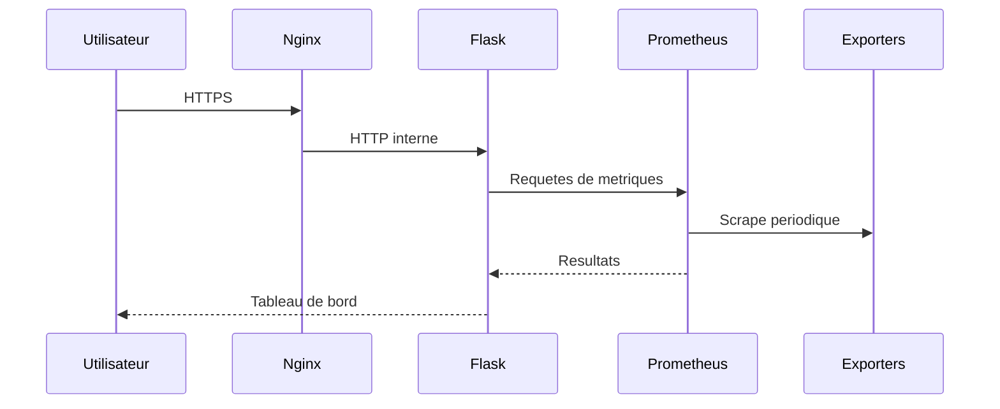
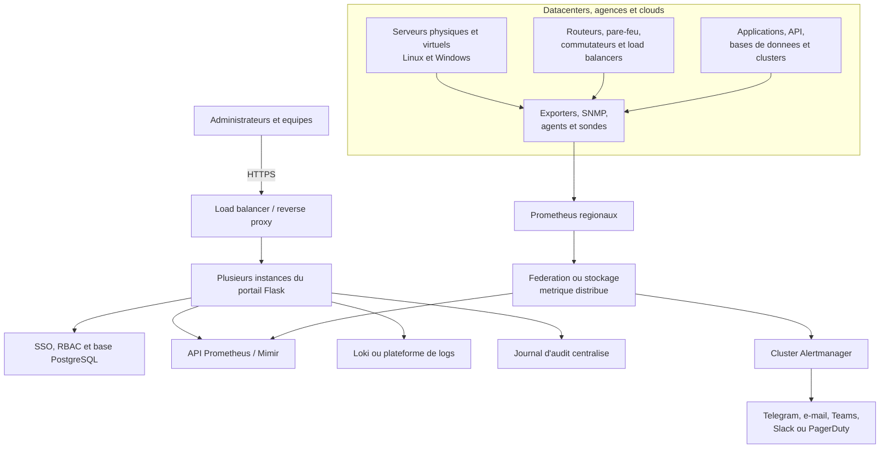

# Architecture

## Composants

- **Nginx** termine TLS et transmet les requetes au portail.
- **Flask/Gunicorn** fournit l'interface, l'authentification, les rapports et les integrations.
- **Prometheus** collecte les metriques de Node Exporter et cAdvisor.
- **Grafana** visualise les metriques.
- **Alertmanager** recoit les alertes Prometheus.
- **Node Exporter** expose les metriques du systeme Linux.
- **cAdvisor** expose les metriques des conteneurs.

## Flux principaux

## Frontieres de confiance

Le reverse proxy est le seul point d'entree prevu. L'application, le socket Docker, les exporters, Prometheus, Grafana et Alertmanager appartiennent au plan d'administration et doivent rester sur des reseaux prives filtres.

Les volumes `application/data`, Prometheus, Grafana et Alertmanager portent l'etat persistant. Ils doivent etre sauvegardes separement du code source.

## Adaptation

Les adresses `192.168.50.x`, noms de conteneurs et chemins `/home/emmanuel/...` sont propres a l'installation d'origine. Remplacez-les par des variables ou valeurs correspondant au nouveau site avant de deployer.

## Architecture cible a grande echelle

Le schema suivant presente une evolution possible de la plateforme pour superviser plusieurs sites, datacenters ou environnements cloud. Le portail Flask reste la couche d'experience et de pilotage, tandis que les composants specialises assurent la collecte, le stockage, l'alerte et la journalisation.

### Lecture du schema

- les utilisateurs accedent au portail par HTTPS, derriere un point d'entree redondant ;
- plusieurs instances Flask evitent qu'un seul serveur devienne un point unique de panne ;
- le SSO et le RBAC centralisent les identites et les autorisations ;
- les serveurs, equipements reseau et applications sont observes par des agents, exporters ou sondes ;
- chaque site peut disposer de son propre Prometheus pour conserver une collecte locale ;
- la federation ou un stockage distribue fournit une vision globale et une conservation longue duree ;
- un cluster Alertmanager distribue les notifications vers les canaux des equipes ;
- les logs et les audits sont conserves separement des metriques.

Cette architecture est une cible d'industrialisation. Le deploiement actuel a deux serveurs constitue le premier niveau fonctionnel de cette trajectoire.
