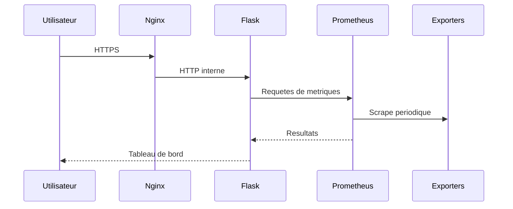

# Architecture

## Composants

- **Nginx** termine TLS et transmet les requetes au portail.
- **Flask/Gunicorn** fournit l'interface, l'authentification, les rapports et les integrations.
- **Prometheus** collecte les metriques de Node Exporter et cAdvisor.
- **Grafana** visualise les metriques.
- **Alertmanager** recoit les alertes Prometheus.
- **Node Exporter** expose les metriques du systeme Linux.
- **cAdvisor** expose les metriques des conteneurs.

## Flux principaux

## Frontieres de confiance

Le reverse proxy est le seul point d'entree prevu. L'application, le socket Docker, les exporters, Prometheus, Grafana et Alertmanager appartiennent au plan d'administration et doivent rester sur des reseaux prives filtres.

Les volumes `application/data`, Prometheus, Grafana et Alertmanager portent l'etat persistant. Ils doivent etre sauvegardes separement du code source.

## Adaptation

Les adresses `192.168.50.x`, noms de conteneurs et chemins `/home/emmanuel/...` sont propres a l'installation d'origine. Remplacez-les par des variables ou valeurs correspondant au nouveau site avant de deployer.
