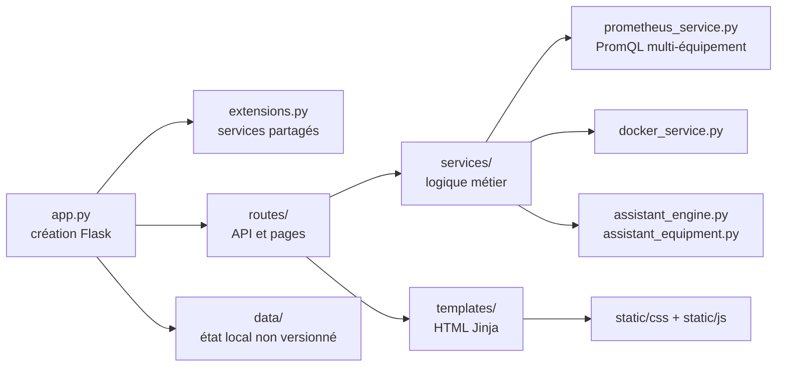

# Guide du code et des fichiers

## Carte générale



## Répertoire `application/`

| Fichier ou dossier | Rôle |
|---|---|
| `app.py` | construit l’application, enregistre les routes et initialise les services |
| `config.py` | lit les variables d’environnement et les paramètres des équipements |
| `extensions.py` | instancie les services réutilisés par les routes |
| `routes/` | contrôleurs HTTP : authentification, monitoring, conteneurs, audit, rapports |
| `services/prometheus_service.py` | exécute les requêtes PromQL et normalise Linux/Windows |
| `services/assistant_engine.py` | orchestre les réponses d’Emma_IA |
| `services/assistant_equipment.py` | réponses temps réel par équipement, comparaison, batterie et volumes |
| `templates/monitoring.html` | structure de la page multi-équipement |
| `static/js/monitoring-equipment.js` | chargement des API, sélecteurs et graphiques |
| `static/css/monitoring-equipment-refined.css` | présentation ordinateur et mobile |
| `telegram_relay.py` | relais Telegram historique de l’application, distinct du Telegram natif Alertmanager |
| `tests/` | non-régression API, Emma, sécurité et interface |
| `.env` | secrets et configuration locale ; jamais dans Git |
| `.env.example` | modèle public sans secret |

## Répertoire `monitoring/`

| Fichier | Rôle |
|---|---|
| `prometheus.yml` | fréquence de collecte, cibles et labels des équipements |
| `alerts.yml` | seuils Linux, Windows, batterie, application et sauvegardes |
| `alertmanager.yml` | regroupement et envoi Telegram |
| `docker-compose.yml` | Prometheus, Grafana, Alertmanager et volumes persistants |

## API multi-équipement

Les principales routes sont :

- `GET /api/equipment` : inventaire et disponibilité ;
- `GET /api/equipment/<nom>/metrics` : valeurs instantanées ;
- `GET /api/equipment/<nom>/history?hours=...` : séries temporelles ;
- routes historiques `/api/metrics` maintenues pour compatibilité.

Le navigateur ne contacte pas directement les exporters. Il appelle Flask, qui interroge Prometheus sur le réseau privé.

## Tests avant déploiement

```bash
python3 -m py_compile app.py config.py extensions.py services/*.py
python -m unittest discover -s tests -p 'test_*.py' -v
docker compose config --quiet
```

Le déploiement suit toujours : sauvegarde, image de test, tests, smoke test, tag de retour arrière, remplacement de production, contrôle de santé et journaux.
